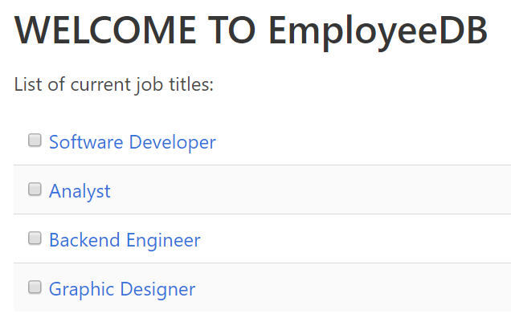
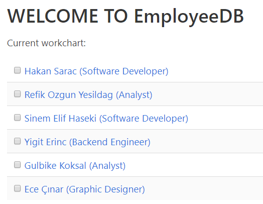

Parts Implemented by Sinem Elif Haseki
=======================================
----------
JOB TITLES
----------
* List of current job titles are seen as follows:
  * Admin view:

  * User view:

Adding job titles to the system
~~~~~~~~~~~~~~~~~~~~~~~~~~~~~~~
* Admins can add job titles with the "Add job title" button in the navigation bar.
.. image:: jobtitle_add.png
    :width: 200
* After addition, list is as follows:

Editing job titles on the system
~~~~~~~~~~~~~~~~~~~~~~~~~~~~~~~
* Admins can edit existing job titles with the "Edit job title" button in the job title page.
.. image:: jobtitle_edit.png
    :width: 200
* For updating, information must be given:
.. image:: jobtitle_edit2.png
    :width: 200

Deleting job titles from the system
~~~~~~~~~~~~~~~~~~~~~~~~~~~~~~~
* Admins can delete existing job titles with the "Delete" button in the list page.
.. image:: jobtitle_delete.png
    :width: 200
* For updating, information must be given:
.. image:: jobtitle_delete2.png
    :width: 200

----------
LEVELS
----------
* List of current levels are seen as follows:
  * Admin view:
    .. image:: level_list.png
    :width: 200
  * User view:
    .. image:: level_user.PNG
    :width: 200

Adding levels to the system
~~~~~~~~~~~~~~~~~~~~~~~~~~~~
* Admins can add levels with the "Add level" button in the navigation bar.
.. image:: level_add.png
    :width: 200
* After addition, list is as follows:

Editing levels of the system
~~~~~~~~~~~~~~~~~~~~~~~~~~~~
* Admins can edit existing levels with the "Edit level" button in the level page.
.. image:: level_edit.png
    :width: 200
* For updating, information must be given:
.. image:: level_edit2.png
    :width: 200

Deleting levels from the system
~~~~~~~~~~~~~~~~~~~~~~~~~~~~
* Admins can delete existing levels with the "Delete" button in the list page.

* For updating, information must be given:

----------
WORKCHARTS
----------
* List of current workcharts are seen as follows:
  * Admin view:

  * User view:
.. image:: workchart_user.PNG
    :width: 200

Adding workchart to the system
~~~~~~~~~~~~~~~~~~~~~~~~~~~~~~~
* Admins can add workchart with the "Add workchart" button in the navigation bar.

* After addition, list is as follows:

Editing workcharts of the system
~~~~~~~~~~~~~~~~~~~~~~~~~~~~~~~~
* Admins can edit existing workcharts with the "Edit workchart" button in the workchart page.
.. image:: workchart_edit.png
    :width: 200
* For updating, information must be given:

Deleting workcharts from the system
~~~~~~~~~~~~~~~~~~~~~~~~~~~~~~~~~~~
* Admins can delete existing workcharts with the "Delete" button in the list page.

* For updating, information must be given:
.. image:: workchart_delete2.png
    :width: 200