Parts Implemented by Hakan Saraç
================================
----------
EMPLOYEES
----------
* List of current employees are seen as follows:
  * Admin view:
    .. image:: employee_list.png
    :width: 200
  * User view:
    .. image:: employee_user.PNG
    :width: 200

Adding employees to the system
~~~~~~~~~~~~~~~~~~~~~~~~~~~~~~~
* Admins can add employee with the "Add employee" button in the navigation bar.
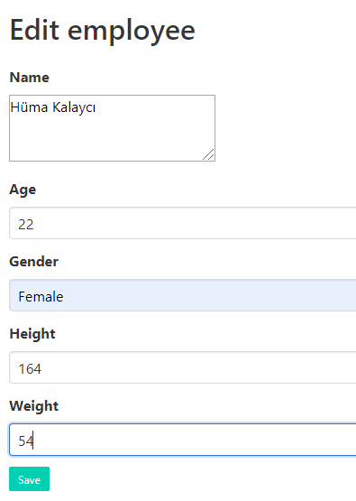
* After addition, list is as follows:
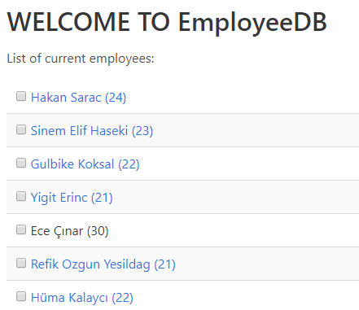

Editing employees on the system
~~~~~~~~~~~~~~~~~~~~~~~~~~~~~~~
* Admins can edit existing employees with the "Edit employee" button in the employee page.
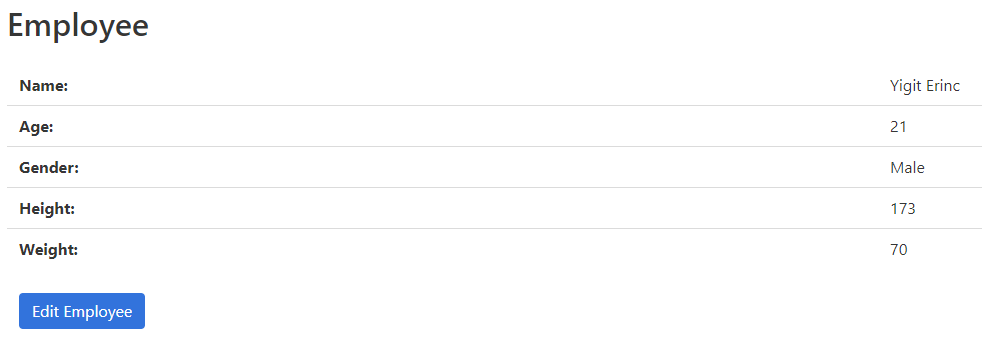
* For updating, information must be given:
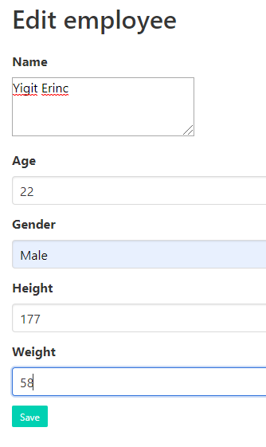

Deleting employees from the system
~~~~~~~~~~~~~~~~~~~~~~~~~~~~~~~
* Admins can delete existing employees with the "Delete" button in the list page.
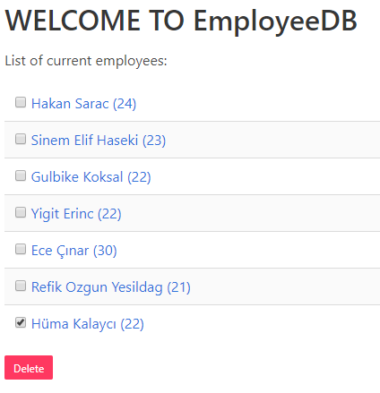
* For updating, information must be given:
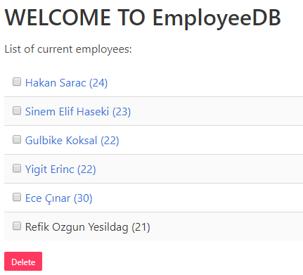

----------
SERVICES
----------
* List of current services are seen as follows:
  * Admin view:
    .. image:: service_list.png
    :width: 200
  * User view:
    .. image:: service_user.PNG
    :width: 200

Adding services to the system
~~~~~~~~~~~~~~~~~~~~~~~~~~~~
* Admins can add services with the "Add service" button in the navigation bar.
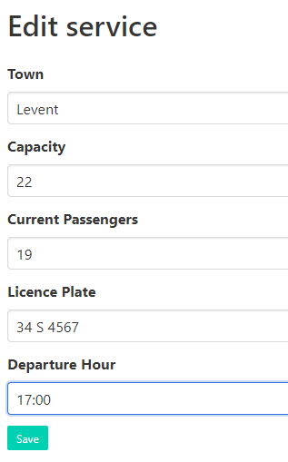
* After addition, list is as follows:
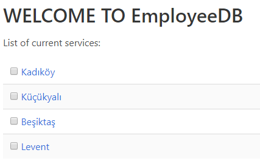

Editing services of the system
~~~~~~~~~~~~~~~~~~~~~~~~~~~~
* Admins can edit existing services with the "Edit service" button in the service page.
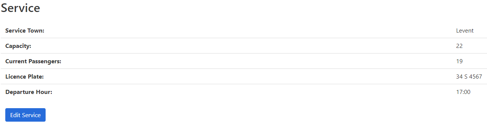
* For updating, information must be given:
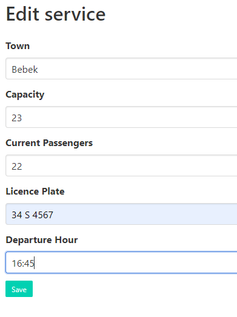

Deleting services from the system
~~~~~~~~~~~~~~~~~~~~~~~~~~~~
* Admins can delete existing services with the "Delete" button in the list page.
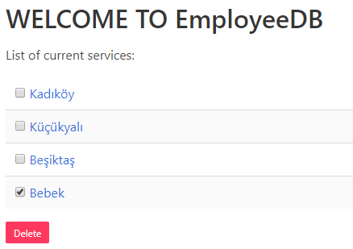
* For updating, information must be given:
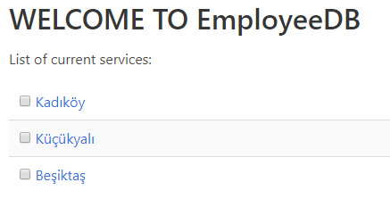

----------------
TRANSPORTATIONS
----------------
* List of current transportations are seen as follows:
  * Admin view:
    .. image:: transportation_list.png
    :width: 200
  * User view:
    .. image:: transportation_user.PNG
    :width: 200

Adding transportation to the system
~~~~~~~~~~~~~~~~~~~~~~~~~~~~~~~
* Admins can add transportations with the "Add transportation" button in the navigation bar.
.. image:: transportation_add.png
    :width: 200
* After addition, list is as follows:
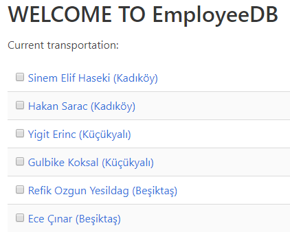

Editing transportations of the system
~~~~~~~~~~~~~~~~~~~~~~~~~~~~~~~~
* Admins can edit existing transportations with the "Edit transportation" button in the transportation page.
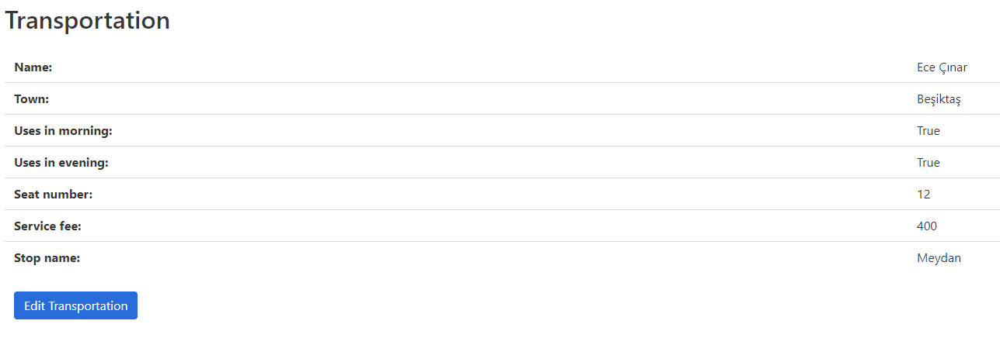
* For updating, information must be given:
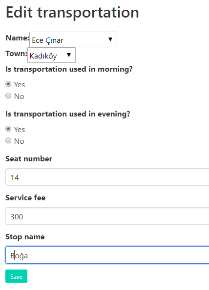

Deleting transportations from the system
~~~~~~~~~~~~~~~~~~~~~~~~~~~~~~~~~~~
* Admins can delete existing transportations with the "Delete" button in the list page.
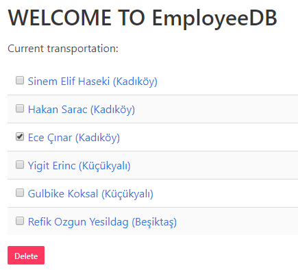
* For updating, information must be given:
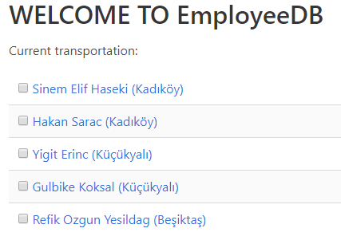