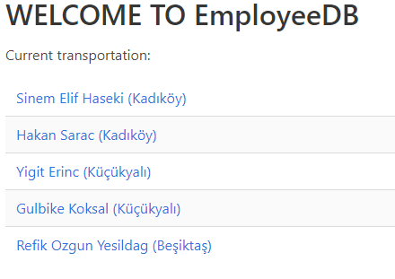
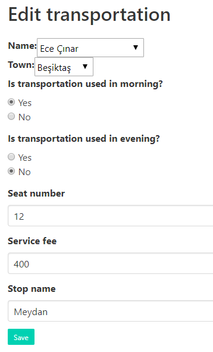

Parts Implemented by Hakan Saraç
================================
----------
EMPLOYEES
----------
* List of current employees are seen as follows:
  * User view:
.. image:: employee_user.PNG
    :width: 400

Adding employees to the system
~~~~~~~~~~~~~~~~~~~~~~~~~~~~~~~
* Admins can add employee with the "Add employee" button in the navigation bar.

* After addition, list is as follows:
.. image:: employee_add2.png
    :width: 400

Editing employees on the system
~~~~~~~~~~~~~~~~~~~~~~~~~~~~~~~
* Admins can edit existing employees with the "Edit employee" button in the employee page.
.. image:: employee_edit.png
    :width: 400
* For updating, information must be given:
.. image:: employee_edit2.png
    :width: 400

Deleting employees from the system
~~~~~~~~~~~~~~~~~~~~~~~~~~~~~~~
* Admins can delete existing employees with the "Delete" button in the list page.
.. image:: employee_delete.png
    :width: 400
* For updating, information must be given:
.. image:: employee_delete2.png
    :width: 400

----------
SERVICES
----------
* List of current services are seen as follows:
  * User view:
.. image:: service_user.PNG
    :width: 400

Adding services to the system
~~~~~~~~~~~~~~~~~~~~~~~~~~~~
* Admins can add services with the "Add service" button in the navigation bar.

* After addition, list is as follows:
.. image:: service_add2.png
    :width: 400

Editing services of the system
~~~~~~~~~~~~~~~~~~~~~~~~~~~~
* Admins can edit existing services with the "Edit service" button in the service page.
.. image:: service_edit.png
    :width: 400
* For updating, information must be given:

Deleting services from the system
~~~~~~~~~~~~~~~~~~~~~~~~~~~~
* Admins can delete existing services with the "Delete" button in the list page.
.. image:: service_delete.png
    :width: 400
* For updating, information must be given:

----------------
TRANSPORTATIONS
----------------
* List of current transportations are seen as follows:
  * User view:

Adding transportation to the system
~~~~~~~~~~~~~~~~~~~~~~~~~~~~~~~
* Admins can add transportations with the "Add transportation" button in the navigation bar.

* After addition, list is as follows:
.. image:: transportation_add2.png
    :width: 400

Editing transportations of the system
~~~~~~~~~~~~~~~~~~~~~~~~~~~~~~~~
* Admins can edit existing transportations with the "Edit transportation" button in the transportation page.
.. image:: transportation_edit.png
    :width: 400
* For updating, information must be given:

Deleting transportations from the system
~~~~~~~~~~~~~~~~~~~~~~~~~~~~~~~~~~~
* Admins can delete existing transportations with the "Delete" button in the list page.
.. image:: transportation_delete.png
    :width: 400
* For updating, information must be given:
.. image:: transportation_delete2.png
    :width: 400